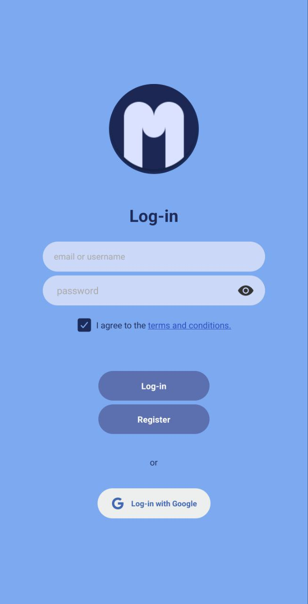
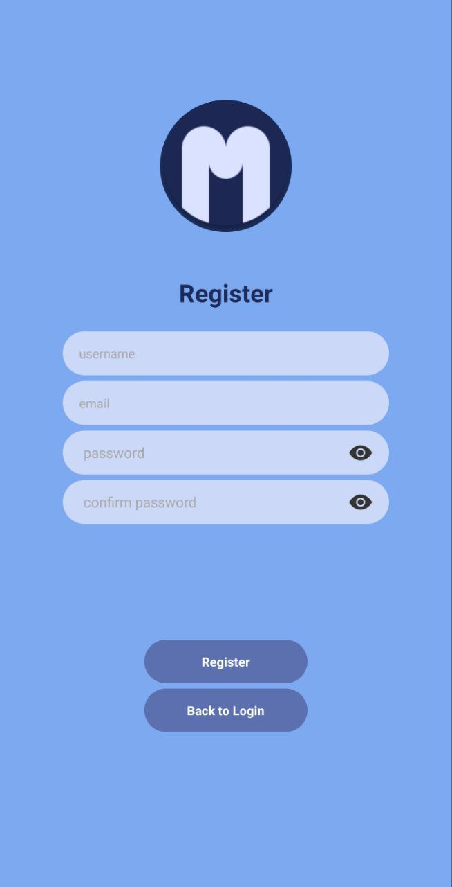
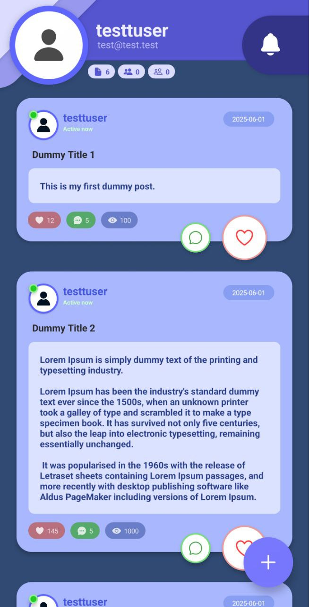
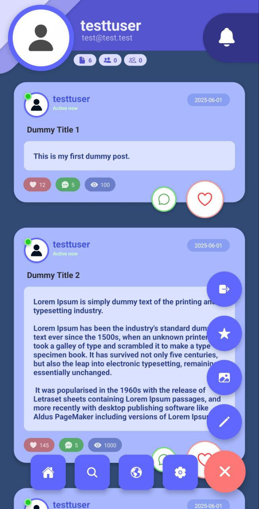
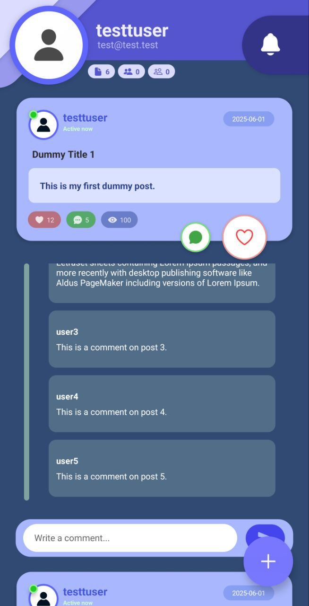
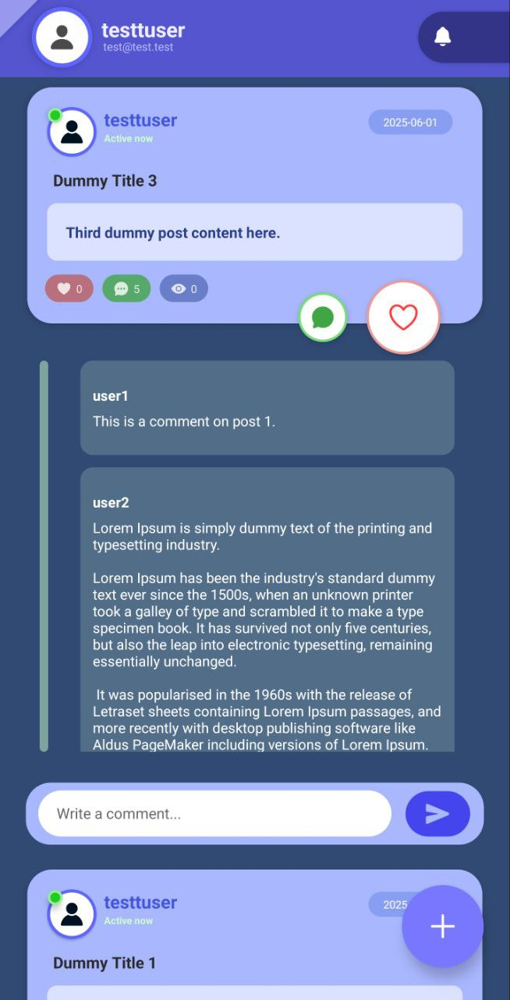
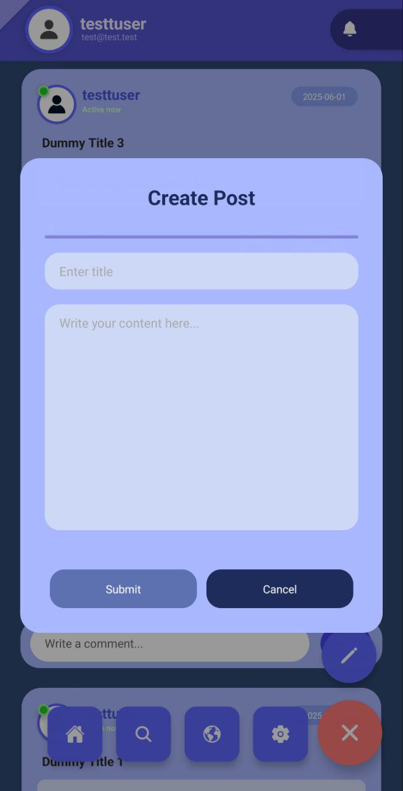

# Project: Mini 📱

---

      
    A Fullstack Mobile Application using  
    ReactNative, Flask, and Firebase

---

    A basic fullstack mobile social media application that fosters simple functions: 
    
      📝: writing posts
      ❤️: liking
      💬: commenting
    
---

    other features include:
    
      👤: basic user authentication
      🔐: ensured security
      ✅: proper error handling
      ⚡: fast and responsive UI

---

<h3 align="center">⚙️------ Tech Stack ------⚙️</h3>
<table align="center">
  <th align="center" width="300"> Backend </th>
  <th align="center" width="300"> Frontend </th>
  <th align="center" width="300"> Database </th>
<tr align="center">
    <td width="300">
        
    </td>
    <td width="300"> 
        
    </td>
    <td width="300"> 
        
    </td>
</tr>
</table>

---

## Screenshots 📱

<table>
    <tr>
        <td>
            
        </td>
        <td>
            
        </td>
        <td>
            
        </td>
        <td>
            
        </td>
        <td>
            
        </td>
        <td>
            
        </td>
        <td>
            
        </td>
    </tr>
</table>

---

## Instructions 📜

-- to add

---
